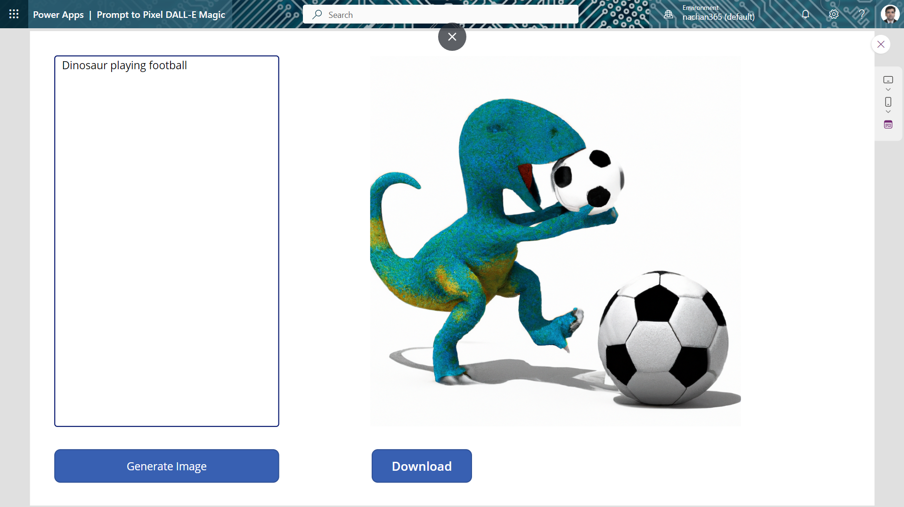

# Prompt to Pixel: DALL-E Magic

## Summary

"Prompt to Pixel: DALL E Magic" app allows you to effortlessly transform your imagination into stunning visual art.

With this app, you can simply input a prompt or description, and watch as DALL-E’s magical powers brings your ideas to life in the form of captivating images.

Whether you're a designer seeking inspiration, a content creator looking for unique visuals, marketer aiming to create eye-catching visuals, a writer in search of cover art for your latest book or article, or simply an individual eager to see your visions come to life, this app is your gateway to a world of endless possibilities.

## Key Features

-- Seamless Prompt Generation: Input your prompts or ideas naturally, and let DALL-E do the rest.
-- Easy Export and Sharing: Save your artwork with ease and share it across various platforms.

## The Hack Team

- [Kunj Sangani](https://github.com/kunj-sangani)
- [Smita Nachan](https://github.com/SmitaNachan)
- [Nanddeep Nachan](https://github.com/nanddeepn)

## Video

